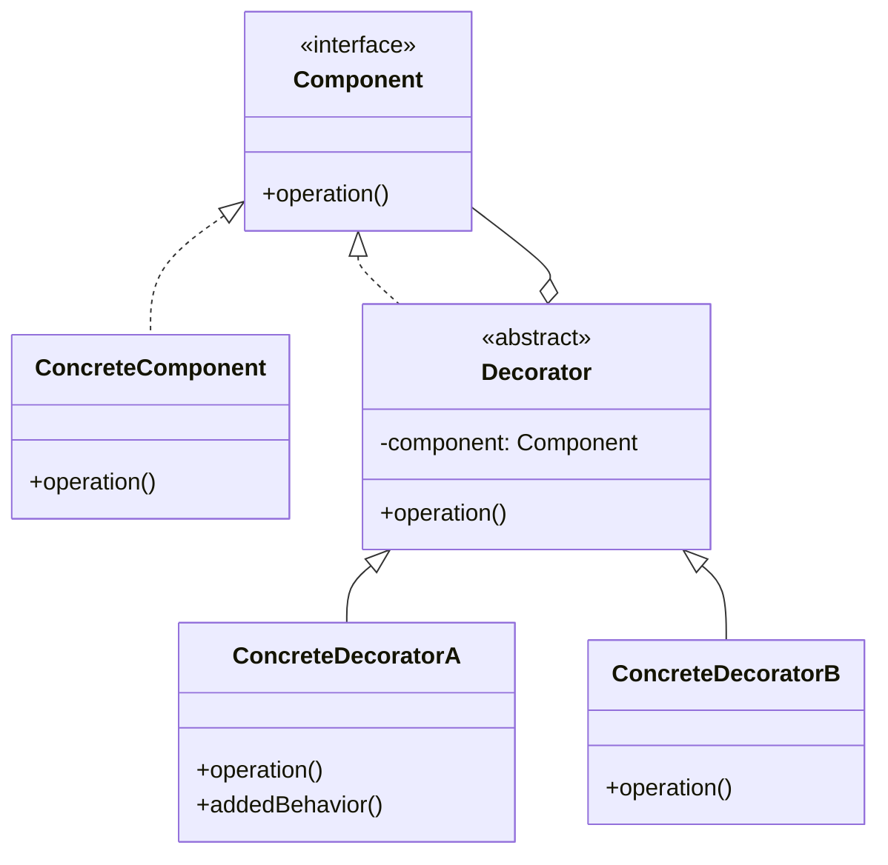

# 装饰器模式 (Decorator Pattern)

> 📖 对应《设计模式之禅》第17章：装饰器模式

---

## 一、概述

**装饰器模式**（Decorator Pattern）动态地给一个对象添加一些额外的职责。就增加功能来说，装饰器模式相比生成子类更为灵活。

> **核心思想**：组合优于继承，像叠罗汉/俄罗斯套娃一样叠加功能。

---

## 二、角色定义

| 角色 | 说明 |
|------|------|
| Component（抽象组件） | 定义业务核心接口 |
| ConcreteComponent（具体组件） | 业务核心接口的实现类（被装饰的对象） |
| Decorator（抽象装饰者） | 持有一个 Component 引用，并实现该接口 |
| ConcreteDecorator（具体装饰者） | 负责给组件添加具体职责 |

---

## 三、版本演进

- `v1_bad` - 类爆炸：使用继承来实现功能组合，导致类数量呈指数级增长。
- `v2_standard` - 标准写法：经典的“俄罗斯套娃”实现，灵活组合功能。
- `v3_architect` - 架构师版本：链式构建或配置化方式，提升 API 可用性。

---

## 四、类图

---

## 五、适用场景

1. **动态扩展**：在不影响其他对象的情况下，动态、透明地给单个对象添加职责。
2. **功能组合**：当扩展功能的数量很多，且可以相互组合时，避免使用继承导致的子类膨胀。
3. **不可控制的类**：当无法通过继承来扩展类（如 `final` 类）时。

---

## 六、JDK 应用

- `java.io.InputStream` 及其子类（如 `BufferedInputStream`, `FileInputStream`）
- `java.util.Collections#synchronizedList()` (包装器)

---

> 📌 **学习建议**：理解装饰器模式的关键在于：装饰者和被装饰者必须**实现同一个接口**（或继承同一个抽象类），这样装饰后的对象仍然可以被当作原始接口使用。
