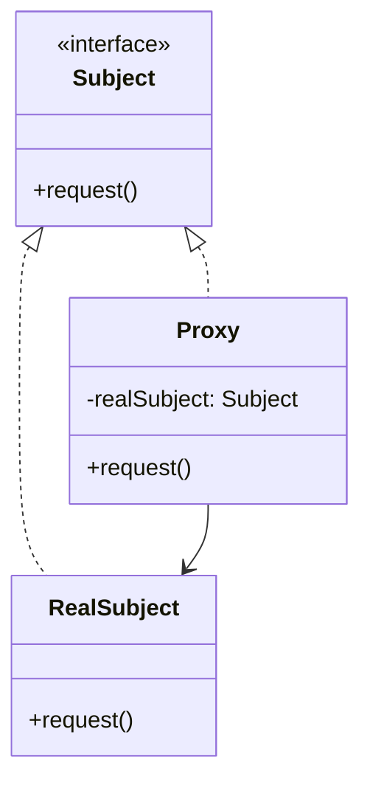

# 代理模式 (Proxy Pattern)

> 📖 对应《设计模式之禅》第12章：代理模式

---

## 一、概述

**代理模式**（Proxy Pattern）为其他对象提供一种代理以控制对这个对象的访问。

> **核心思想**：中介隔离，控制访问。

---

## 二、角色定义

| 角色 | 说明 |
|------|------|
| Subject（抽象主题） | 定义代理和真实主体的共同接口 |
| RealSubject（真实主题） | 真正执行业务逻辑的对象 |
| Proxy（代理对象） | 持有 RealSubject 引用，控制其访问 |

---

## 三、版本演进

- `v1_bad` - 烂代码：直接调用业务逻辑，无代理
- `v2_static` - 静态代理：手动编写代理类
- `v3_dynamic_jdk` - JDK 动态代理：基于接口的动态代理
- `v4_dynamic_cglib` - CGLIB 动态代理：基于继承的动态代理

---

## 四、类图

---

## 五、适用场景

1. **远程代理**：为远程对象提供本地代表
2. **虚拟代理**：延迟加载（如图片占位）
3. **保护代理**：权限控制
4. **智能引用**：增加额外操作（如日志、耗时统计）

---

## 六、JDK 应用

- `java.lang.reflect.Proxy` (动态代理)
- `PreparedStatement` (JDBC)

---

> 📌 **学习建议**：理解代理模式的关键在于"控制访问"，不仅是功能增强（那是装饰器模式的侧重点）。
